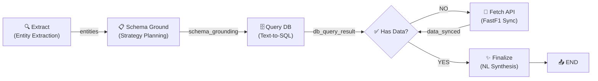
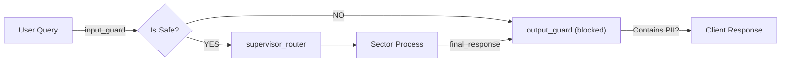

# TWG Sports Intelligence Platform: Architecture Documentation

**Last Updated:** April 7, 2026  
**Owner:** Atharv Parab  
**Status:** Production (FastAPI + LangGraph + SSE Streaming)
**Recent Updates:** HITL Resumption Loop, JSON Parsing Robustness, State Initialization Fix

---

## Overview

The TWG platform is a **multi-domain LLM-powered sports intelligence system** that:
- Routes natural-language queries to specialized agents (F1, Football, Baseball)
- Streams responses in real-time via SSE dual-stream (node updates + token chunks)
- Supports Human-in-the-Loop approvals for high-cost API operations
- Persists conversation state via thread_id and LangGraph Checkpointer

### Core Tech Stack

| Layer | Technology | Purpose |
|---|---|---|
| **Frontend** | React (Vite) | Real-time chat with trace visualization |
| **API** | FastAPI + Uvicorn | HTTP + SSE streaming gateway |
| **Orchestration** | LangGraph + LangChain | Multi-agent state machine with checkpointing |
| **LLMs** | Groq API | Router (8B), Extraction (8B), SQL (70B), Synthesis (120B) |
| **Safety** | Llama Guard 2 (22M) | Input/output guardrails |
| **F1 Data** | FastF1 + Neon PostgreSQL | Telemetry with PARTITION BY year |
| **Soccer Data** | football-data.org API | Live standings & match data |
| **Baseball Data** | pybaseball | Dodgers statistics |

---

## 1. High-Level Flow: FastAPI + LangGraph Lifecycle

### 1.1 Request Lifecycle

```
HTTP POST /chat/stream (FastAPI)
    ↓
ChatRequest (query, user_role, thread_id)
    ↓
stream_chat_agentic() → graph.astream(config)
    ↓
LangGraph Supervisor Router + Sector Subgraph
    ↓
SSE Dual-Stream Output (updates + messages)
    ↓
StreamingResponse (text/event-stream)
```

### 1.2 Supervisor-Router Pattern

The **main graph** (in `main.py`) implements a hierarchical routing pattern:

```
START
  ↓
input_guard (Llama Guard 2 - safety check)
  ↓
supervisor_router (LLM-based intent classifier)
  ├─→ "f1_sector" (Formula 1)
  ├─→ "football_sector" (Soccer)
  └─→ "baseball_sector" (Baseball)
  ↓
output_guard (PII/toxicity filter)
  ↓
END
```

**Key Implementation** (`main.py:62-105`):
- Uses `ChatGroq(llama-3.1-8b-instant)` for fast routing
- Parses LLM response with fallback to `DEFAULT_SECTOR` ("f1_sector")
- Returns `domain_detected` field that drives conditional routing
- Decorated with `@retry` (exponential backoff, max 3 attempts)

### 1.3 SSE Dual-Stream Output

The `/chat/stream` endpoint (`backend_streaming.py:349-379`) emits two parallel event streams:

1. **"update" events** (Thought Trace)
   - Emitted when nodes execute
   - Contains: `{type: "update", data: {node: "extract", status: "executing"}}`
   - Frontend displays in **Trace Panel**

2. **"message" events** (Token Stream)
   - Emitted when LLM produces tokens
   - Contains: `{type: "message", data: {token: "...", is_final: false}}`
   - Frontend appends to chat bubble in real-time

**Stream Implementation** (`backend_streaming.py:189-232`):
```python
async for event in graph.astream(initial_state, config, stream_mode=["updates", "messages"]):
    stream_type, data = event
    
    if stream_type == "updates":
        # Node execution trace → emit_update()
    elif stream_type == "messages":
        # LLM tokens → emit_message()
```

---

## 2. State & Memory: Thread-Based Persistence

### 2.1 AgentState Definition

All state flows through a single **AgentState** (in `state.py`):

```python
class AgentState(TypedDict):
    messages: Annotated[Sequence[BaseMessage], operator.add]  # Append-only
    query: str
    user_role: str
    domain_detected: str
    final_response: str
    is_safe: bool
    guardrail_reason: str
```

**Key Properties:**
- `messages` uses `operator.add` → automatically concatenates across nodes
- `domain_detected` → stores the sector selected by supervisor_router
- `is_safe` → set by input_guard; if false, flow routes to "blocked" path

### 2.2 Memory Saver Checkpointer

The platform uses **LangGraph's MemorySaver** for cross-session persistence:

```python
# main.py:181-182
memory = MemorySaver()
graph = builder.compile(checkpointer=memory)
```

**Thread Configuration** (`backend_streaming.py:172`):
```python
config = {"configurable": {"thread_id": thread_id}}
initial_state = {
    "messages": [HumanMessage(content=query)],
    "query": query,
    "user_role": user_role,
    ...
}

# Stream execution with persistent thread
async for event in graph.astream(initial_state, config, stream_mode=["updates", "messages"]):
    ...
```

**What This Enables:**
- **Persistent Conversations:** Each `thread_id` maintains its own state snapshot
- **HITL Resumption:** When graph pauses, state is saved; resumption replays from checkpoint
- **Multi-User Sessions:** Each frontend session generates a unique `threadId` (UUID) on mount
- **Cross-API Calls:** The same `thread_id` is sent to both `/chat/stream` and `/chat/resume`

### 2.3 Frontend Thread Management

From `useSportsAgent.js:10`:
```javascript
const threadId = useMemo(() => crypto.randomUUID(), []);
```

- Generated **once per session** (on component mount)
- Passed in every request: `{ query, user_role: 'admin', thread_id: threadId }`
- Enables resumption if user clicks "Approve" after HITL interrupt

---

## 3. HITL Cycle: Human-in-the-Loop Control

### 3.1 The Interrupt Pattern

When a sector node (e.g., **F1 Fetch Node**) encounters a **high-cost API call**, it sends an **interrupt** by using LangGraph's checkpointer + `Command(resume=...)`.

**Detection Mechanism** (`backend_streaming.py:235-241`):
```python
current_state = graph.get_state(config)

if current_state.next:  # current_state.next is non-empty when graph is paused
    logger.info("Graph paused for Human-in-the-Loop.")
    yield format_sse_event(
        event_type="interrupt",
        data={"message": "Waiting for API approval"}
    )
```

**Frontend HITL Response** (`useSportsAgent.js:120-123`):
```javascript
if (event.type === 'interrupt') {
    setHitlState({ isWaiting: true, data: event.data || null });
    setIsStreaming(false);
    return;  // Stop listening; wait for user action
}
```

### 3.2 Resume Pattern with Command

When user clicks **"Approve"**, the frontend calls `/chat/resume`:

**Frontend Call** (`useSportsAgent.js:177-183`):
```javascript
const res = await fetch('http://localhost:8000/chat/resume', {
    method: 'POST',
    headers: { 'Content-Type': 'application/json' },
    body: JSON.stringify({
        thread_id: threadId,
        action: approved ? 'approved' : 'rejected',
    }),
});
```

**Backend Resume Handler** (`backend_streaming.py:383-417`):
```python
@app.post("/chat/resume")
async def chat_resume(request: Request) -> dict:
    payload = await request.json()
    thread_id = payload.get("thread_id", "session_user")
    config = {"configurable": {"thread_id": thread_id}}
    
    try:
        resume_value = payload.get("action", "approved")
        
        # Use Command to resume from the breakpoint
        for event in graph.stream(Command(resume=resume_value), config):
            pass
        
        final_state = graph.get_state(config)
        values = final_state.values
        
        # Extract final response from sector subgraph
        if "football_sector" in values:
            answer = values["football_sector"].get("final_response")
        elif "f1_sector" in values:
            answer = values["f1_sector"].get("final_response")
        else:
            answer = values.get("final_response", "Process complete.")
        
        return {"status": "success", "final_response": answer}
    except Exception as e:
        raise HTTPException(status_code=500, detail=str(e))
```

**Key Pattern:**
- `graph.stream(Command(resume=resume_value), config)` replays from the paused checkpoint
- The `thread_id` in config ensures we're resuming the **correct conversation**
- After resumption completes, we fetch the final state and extract the response

### 3.3 Improved Resume Handler: Multi-Pause Loop

**Enhancement (April 7, 2026):** The `/chat/resume` endpoint now properly handles **multiple pauses** in a single approval cycle. This enables self-correcting loops (like Football's QA Critic) to work seamlessly.

**Previous Issue:**
- If a sector graph looped back (e.g., `should_revise() → "api_execute"` in football_agent), it would hit `interrupt_before` again
- The old `/chat/resume` would return after resuming once, leaving the graph paused
- Frontend would show "execution completed" but no final response was returned

**Fixed Implementation** (`backend_streaming.py:383-417`):
```python
@app.post("/chat/resume")
async def chat_resume(request: Request) -> dict:
    payload = await request.json()
    thread_id = payload.get("thread_id", "session_user")
    config = {"configurable": {"thread_id": thread_id}}
    
    try:
        resume_value = payload.get("action", "approved")
        
        # Keep resuming until graph finishes (handles multiple pauses)
        while True:
            # Resume from the breakpoint
            for event in graph.stream(Command(resume=resume_value), config):
                pass
            
            # Check if graph is still paused
            final_state = graph.get_state(config)
            if not final_state.next:
                # Graph finished, no more pauses
                break
            # If still paused, resume again automatically
            logger.info(f"Graph paused again at {final_state.next}, resuming...")
        
        # Extract final response from shared AgentState
        answer = values.get("final_response", "Process complete.")
        return {"status": "success", "final_response": answer}
```

**Key Improvement:**
- While loop continues resuming until `current_state.next` is empty (graph complete)
- Handles sector graphs that loop back to the same `interrupt_before` node
- Automatically approves subsequent pauses within the same approval cycle
- Only returns to frontend when the graph is truly finished

**Use Case:** Football agent's critic feedback loop:
1. User approves → `/chat/resume` called
2. API executes, gets standings instead of match details
3. QA reflection detects failure, calls `should_revise()` → returns "api_execute"
4. Graph hits `interrupt_before=["api_execute"]` again
5. `/chat/resume` **automatically resumes** (loop continues)
6. LLM tries again with feedback from critic
7. Second attempt succeeds (QA passes)
8. Loop breaks, graph finishes
9. Final response returned to frontend

### 3.4 Where Interrupts Occur

Sector nodes can pause the graph by reaching a **human-approval node**. Currently used in:
- **Football Agent:** `interrupt_before=["api_execute"]` (before API tool calling)
- **F1 Agent:** Could be added before `fetch` node (FastF1 API call)
- **Baseball Agent:** Could be added before expensive pybaseball fetches

The pattern:
1. Graph executes normally
2. Before invoking expensive API, reaches `interrupt_before` node
3. Graph pauses; `current_state.next = "api_execute"` (the paused node)
4. Frontend receives "interrupt" event type → shows Approval Card
5. User clicks "Approve"
6. Frontend calls `/chat/resume` with thread_id and action
7. Backend uses `Command(resume=action)` to continue from checkpoint
8. Graph executes, and if it loops back to the same interrupt point, `/chat/resume` auto-resumes
9. Stream resumes when graph finally completes, emitting final response

---

## 4. Sector Subgraphs: 5-Node Architecture

### 4.1 F1 Sector Flow Diagram



### 4.2 Node Details

#### **Node 1: Extract** (`f1_agent.py:199-228`)
- **Input:** `state.query` (e.g., "Who had the fastest lap at Monaco 2024?")
- **Task:** Parse named entities from the query
- **Output:** `entities = {year, event_name, driver, team, lap_number}`
- **LLM:** `llama-3.1-8b-instant` (fast extraction)
- **Fallback:** Returns None for missing fields

#### **Node 1.5: Schema Ground** (`f1_agent.py:231-281`)
- **Input:** `query` + `entities`
- **Task:** Plan the SQL strategy against the `f1_telemetry` schema
- **Output:** `schema_grounding = {question_type, relevant_tables, relevant_columns, strategy, needs_validation}`
- **LLM:** `llama-3.3-70b-versatile` (heavy reasoning for planning)
- **Purpose:** Separates query intent from execution; creates query plan artifact

#### **Node 2: Query DB** (`f1_agent.py:287-359`)
- **Input:** `entities`, `schema_grounding`, `query`
- **Task:** Execute SQL against `f1_telemetry` table using LangChain SQL Agent
- **Output:** `db_query_result = <SQL result or "NO_DATA_IN_DB">`
- **LLM:** SQL Agent from LangChain (openai-tools type)
- **Fallback:** If table is empty, returns "NO_DATA_IN_DB"

#### **Node 3: Fetch API** (`f1_agent.py:362-410`) ⚠️ **HITL Checkpoint**
- **Input:** `entities`, `db_query_result`, `fetch_attempts`
- **Task:** Call FastF1 API, download telemetry, sync to Neon PostgreSQL
- **Output:** `data_synced = True/False`, `fetch_attempts` incremented
- **Max Retries:** 2 (prevents infinite loops)
- **Safeguard:** Returns error if `fetch_attempts >= MAX_FETCH_ATTEMPTS`
- **This is where the HITL interrupt could be triggered** (before sync)

#### **Decision Node** (`f1_agent.py:413-444`)
- **Input:** `db_query_result`, `data_synced`, `fetch_attempts`
- **Task:** Route based on query result
- **Output:** Conditional edge to: "query" (loop), "fetch" (sync), or "end" (finalize)
- **Logic:**
  ```
  if data_synced → "query"       # Loop back, now data exists
  elif no_data_in_db AND attempts < 2 → "fetch"  # Try to sync
  else → "end"                    # Finalize response
  ```

#### **Node 4: Finalize** (`f1_agent.py:447-489`)
- **Input:** `db_query_result`, `final_response`, `query`
- **Task:** Convert raw SQL result to conversational response
- **Output:** `final_response = <Natural language answer>`
- **LLM:** `openai/gpt-oss-120b` (synthesis; higher quality)
- **Safety:** Never mentions "databases", "SQL", "tables", "rows"

### 4.3 Flow Control Logic

The **Decision Node** implements a cycle:

```python
f1_internal_builder.add_conditional_edges(
    "decide",
    lambda state: (
        "end" if state.get("final_response") else
        "query" if state.get("data_synced") else
        "fetch" if "no_data_in_db" in state.get("db_query_result", "").lower() 
                   and state.get("fetch_attempts", 0) < 2 else
        "end"
    ),
    {
        "query": "query",
        "fetch": "fetch",
        "end": "finalize"
    }
)
```

**Example Flow:**
1. Query → DB returns "NO_DATA_IN_DB"
2. Decision → route to "fetch"
3. Fetch → syncs data, sets `data_synced = True`
4. Decision → detects `data_synced`, routes back to "query"
5. Query → now finds data (re-executes SQL)
6. Decision → detects data exists, routes to "end"
7. Finalize → synthesizes result

### 4.4 Football Sector: Self-Correcting Agent with QA Critic

**Architecture** (`football_agent.py`):
```
START → extract → api_execute (INTERRUPT_BEFORE) → reflect → finalize → END
                       ↑_____________________________________________|
                       (if revision needed)
```

**Node Details:**

**Extract Node** (`football_agent.py:202-219`):
- Parses: `{league, team, year, is_live}`
- Uses `parse_json_safely()` for robust JSON extraction (handles LLM commentary)

**API Execute Node** (`football_agent.py:221-251`):
- Uses `create_react_agent` with tools:
  - `get_league_standings(league, season)` → table data
  - `get_team_matches(team, status="FINISHED"|"SCHEDULED"|"IN_PLAY")` → **NEW** match history
  - `get_live_match_data(team)` → live scores
- LLM selects appropriate tool based on TOOL SELECTION GUIDE in system prompt
- **Safeguard:** Only answers Chelsea FC questions (system prompt enforces this)
- **New Tool (April 7):** `get_team_matches()` fetches past/upcoming matches (solves "last game" queries)
  - Status filter: "FINISHED" for past matches, "SCHEDULED" for upcoming
  - Returns last 5 matches with date, teams, scores
  - **Bug Fixed:** Now handles IN_PLAY matches correctly (uses current score instead of fullTime)

**Reflection Node (QA Critic)** (`football_agent.py:253-277`):
- **Purpose:** Validates if agent answered the user's question correctly
- **Implementation:**
  ```python
  critic_prompt = """
  You are a strict QA Manager...
  Did the agent successfully and clearly answer the user's question?
  - If yes, reply EXACTLY with: PASS
  - If no, reply with a 1-sentence instruction on what it must fix.
  """
  ```
- **Output:** `feedback = "PASS"` or specific instruction (e.g., "The agent must fetch the last game result, not standings")
- **Revision Count:** Tracks iterations; max 2 revisions before forcing finalize

**Routing Logic** (`football_agent.py:284-296`):
```python
def should_revise(state: FootballSubState):
    feedback = state.get("feedback", "")
    revision_count = state.get("revision_count", 0)
    
    if revision_count >= 2:
        return "finalize"  # Safety: prevent infinite loops
    
    if feedback == "PASS":
        return "finalize"
    else:
        return "api_execute"  # Loop back for retry
```

**Self-Correction Cycle Example:**
1. User: "How was Chelsea's last game?"
2. Extract: `{team: "Chelsea", is_live: False, league: "Premier League"}`
3. API Execute: LLM calls `get_league_standings()` (wrong tool!)
4. Agent returns: "Chelsea is rank 4 with 69 points"
5. QA Reflect: "FAILED. The agent provided standings instead of the last game result. It must use get_team_matches(status=FINISHED)"
6. **Should Revise:** Routes back to `api_execute` (loop = 1)
7. API Execute (Retry): LLM sees feedback, calls `get_team_matches(status=FINISHED")`
8. Agent returns: "Chelsea 2-1 Arsenal on April 5, 2026"
9. QA Reflect: "PASS"
10. Finalize: Returns conversational response

**Human-in-the-Loop Integration:**
- Graph pauses **before** step 3 (before api_execute)
- Frontend shows "Approve API call" prompt
- User clicks Approve
- Backend calls `/chat/resume` with auto-loop resumption (handles steps 3-10)
- Final response returned to user

**Baseball Agent** (`baseball_agent.py`):
- Uses `create_sql_agent` on Dodgers-specific tables: `dodgers_roster`, `dodgers_batting_season`, `dodgers_pitching_season`, `dodgers_game_logs`, `dodgers_statcast`
- Schema grounding via `read_init_db_schema()` tool (reads `baseball_db_init.py`)
- State: `BaseballSubState` with `schema_grounding`, `fetch_attempts`, `data_synced`
- **Improvements (April 7):**
  - Updated `parse_json_safely()` to use regex extraction (robust to LLM commentary)
  - Added SQL safety whitelist: validates table_name against VALID_TABLES dict
  - Upgraded synthesis LLM from `llama-3.1-8b` → `openai/gpt-oss-120b` for better response quality

---

## 5. Security Layer: Llama Guard + Guardrails AI

### 5.1 Input Guardrail (Llama Guard 2)

**Location:** `main.py:108-123` → `global_input_guard_node`

```python
def global_input_guard_node(state: AgentState) -> dict:
    query = state.get("query", "")
    
    # Llama Guard 2 safety classifier
    res = safety_checker.invoke([HumanMessage(content=query)])
    
    if "unsafe" in res.content.lower():
        return {
            "is_safe": False,
            "guardrail_reason": res.content,
            "final_response": "I cannot process this request due to safety policies."
        }
    
    return {"is_safe": True, "guardrail_reason": ""}
```

**LLM:** `meta-llama/llama-prompt-guard-2-22m`
- Specialized safety classification model
- Detects: harmful, hateful, illegal, and policy-violating content
- **If unsafe:** Sets `is_safe=False`, routes to `output_guard` (END), blocks processing

**Route Logic:**
```
START → input_guard
    ↓
Is safe?
├─→ YES → supervisor_router (proceed)
└─→ NO → output_guard (blocked) → END
```

### 5.2 Output Guardrail (Guardrails AI-style PII Check)

**Location:** `main.py:125-133` → `global_output_guard_node`

```python
def global_output_guard_node(state: AgentState) -> dict:
    response = state.get("final_response", "")
    
    # Example: Ensure PII or toxic content didn't leak
    if "Social Security" in response or "credit card" in response.lower():
        return {"final_response": "I cannot provide that information due to safety policies."}
    return {}
```

**Current Implementation:**
- Regex-based PII detection (Social Security #, credit card patterns)
- Can be extended with Guardrails AI framework for structured validation

**Extensibility:**
```python
# Future: Add Guardrails AI for stricter output validation
from guardrails import Guard, validators

guard = Guard.from_string_validators(
    validators=[
        validators.ValidJSON(),
        validators.ToxicLanguage(),
        validators.PrivateKeyValidator()
    ]
)
```

### 5.3 Security Flow Diagram



---

## 6. API Endpoints Summary

### 6.1 POST /chat/stream
**Purpose:** Primary streaming endpoint for agent queries

**Request Body:**
```json
{
    "query": "Who had the fastest lap at Monaco 2024?",
    "user_role": "admin",
    "thread_id": "550e8400-e29b-41d4-a716-446655440000"
}
```

**Response:** `text/event-stream` with SSE events
```
data: {"type":"update","timestamp":"2026-04-06T...","data":{"node":"extract","status":"executing"}}\n\n
data: {"type":"message","timestamp":"2026-04-06T...","data":{"token":"Charles","is_final":false}}\n\n
data: {"type":"message","timestamp":"2026-04-06T...","data":{"token":" Leclerc","is_final":false}}\n\n
```

### 6.2 POST /chat/resume
**Purpose:** Resume paused graph after HITL approval

**Request Body:**
```json
{
    "thread_id": "550e8400-e29b-41d4-a716-446655440000",
    "action": "approved"
}
```

**Response:**
```json
{
    "status": "success",
    "final_response": "Charles Leclerc had the fastest lap..."
}
```

### 6.3 POST /chat (Non-Streaming Fallback)
**Purpose:** Synchronous endpoint for simple clients

**Request Body:** Same as `/chat/stream`

**Response:**
```json
{
    "status": "success",
    "response": "Charles Leclerc had the fastest lap...",
    "query": "Who had the fastest lap at Monaco 2024?",
    "timestamp": "2026-04-06T..."
}
```

### 6.4 POST /token
**Purpose:** OAuth2-style login (form-encoded)

**Request:** `form-data: username=atharv_admin&password=nyu2025`

**Response:**
```json
{
    "access_token": "session_for_atharv_admin",
    "token_type": "bearer"
}
```

### 6.5 GET /health
**Purpose:** Health check

**Response:**
```json
{
    "status": "healthy",
    "timestamp": "2026-04-06T...",
    "streaming_enabled": true
}
```

---

## 7. Key Design Decisions

### 7.1 Supervisor Router Pattern
- **Why:** Multi-domain platform requires intent classification before processing
- **Trade-off:** Extra LLM call (8B model) adds ~50-200ms latency, but ensures correctness

### 7.2 SSE Dual-Stream
- **Why:** Real-time UX requires both node progress (transparency) and token progress (responsiveness)
- **Trade-off:** Client must handle two event types; simpler to debug than WebSocket

### 7.3 Thread-based Memory
- **Why:** Enables multi-turn conversations and HITL resumption without session overhead
- **Trade-off:** MemorySaver is in-memory; doesn't survive app restart (can be swapped for PostgresSaver)

### 7.4 Sector Subgraph Architecture
- **Why:** Isolates domain logic (F1 vs Football vs Baseball); enables independent scaling
- **Trade-off:** State must be managed across graph boundaries (AgentState bridge)

### 7.5 HITL at API Boundary
- **Why:** Prevents unintended API calls (cost control, compliance)
- **Trade-off:** Breaks streaming flow; requires async client state management

---

## 8. Deployment Checklist

- [ ] Environment variables: `GROQ_API_KEY`, `FOOTBALL_DATA_API_KEY`, database URLs
- [ ] MemorySaver → PostgresSaver (production persistence)
- [ ] Input/Output guardrails → integrate with Guardrails AI framework
- [ ] CORS: update `allow_origins` from `localhost:5173` to production domain
- [ ] Logging: rotate logs; disable debug prints in production
- [ ] Rate limiting: add middleware for `/chat/stream` (prevent abuse)
- [ ] Monitoring: add instrumentation for node execution times and LLM latency

---

## 9. Glossary

| Term | Definition |
|------|-----------|
| **AgentState** | Global state dictionary flowing through all nodes |
| **Thread ID** | Unique identifier for a conversation session; enables resumption |
| **Checkpointer** | LangGraph component that saves/restores state at breakpoints |
| **Supervisor Router** | LLM-based router that classifies intent and selects sector |
| **Sector Subgraph** | Domain-specific graph (F1, Football, Baseball) executed as a node |
| **SSE** | Server-Sent Events; one-way streaming protocol for real-time updates |
| **HITL** | Human-in-the-Loop; requires user approval before high-cost actions |
| **Interrupt** | LangGraph mechanism to pause execution at a checkpoint |
| **Command(resume=...)** | LangGraph API to resume from an interrupt with a resume value |

---

## 10. Architecture Evolution Roadmap

**Phase 1 (Current):**
- MemorySaver (in-memory)
- Llama Guard 2 (input only)
- Single supervisor router
- SSE dual-stream

**Phase 2:**
- PostgresSaver (persistent checkpoints)
- Guardrails AI (structured output validation)
- Tool-use routing (instead of LLM router)
- WebSocket upgrade for lower latency

**Phase 3:**
- Multi-turn conversation memory
- Long-context sector graphs (for multi-turn debugging)
- Observability: Traces, Metrics, Logs
- A/B testing framework for routing strategies
